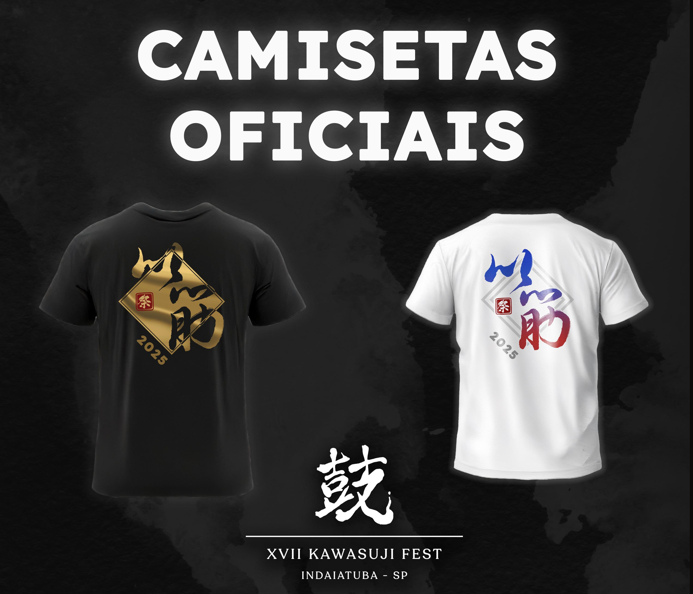

_Início das Vendas Antecipadas das Camisetas Oficiais do XVII Festival Kawasuji_

Foram iniciadas as vendas das Camisetas Oficiais do evento!

1. Acesse o link abaixo para realizar pedidos individuais ou em grupo
2. Siga os direcionamentos do formulário, se atentando à quantidade inserida e aos tamanhos
3. Realize o pagamento para confirmar seu pedido antecipado.

## [Link para o Formulário de Camisetas Oficiais!](https://forms.gle/En8LLUxQStM82Zx36)

### As vendas antecipadas terminam dia 13/02!
Após essa data, só será possível adquirir unidades durante o evento nos dias 15 e 16 de março.

 

[[Top]](#top)

Caso precise de ajuda para ingressar na (3) Lista de Comunicação, entre em [Contato](https://festivalkawasuji.com.br/contato) via e-mail ou WhatsApp indicando seu nome e e-mail do grupo correspondente.
 
 
 
 
**Observação**: Enquanto estiver lidando com meios de comunicação online, certifique-se de cuidar de sua privacidade. Sua segurança é a prioridade!
 
 
 
 