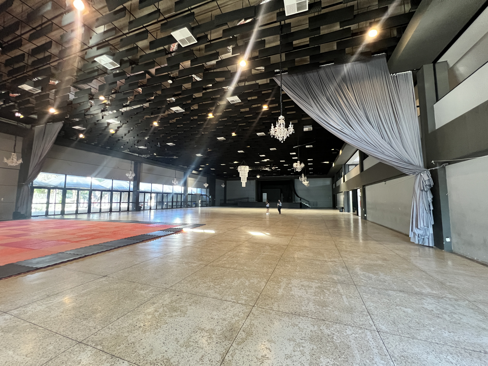
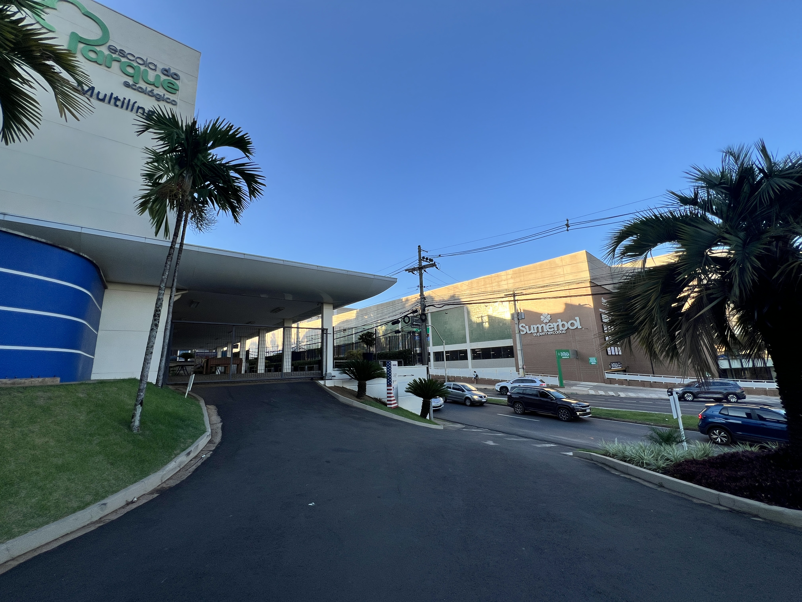

_Locais de realização dos 2 dias de evento_

# 1. Workshop e Apresentações

## Clube 9 de Julho
<!-- Inserir Imagem da fachada do Clube 9 -->

- **Localização**: Av. Pres. Vargas, 2000 - Centro, Indaiatuba
- **Atividades realizadas**:
  - Workshop Geral
  - Apresentações dos grupos
  - Refeições
  - Cafés
- **Descrição**: O Clube 9 de Julho possui 65 anos de tradição e se consolida como uma das maiores estruturas da cidade de Indaiatuba no quesito realização de eventos musicais. Bailes, formaturas e shows acontecem todos os finais de semana em seu Salão Principal, que conta com porte para 3.000 pessoas, cozinha industrial, climatização e estrutura de palco com módulos expansivos.

 
 

# 2. Banhos e Pernoite

## Colégio Objetivo
    

- **Localização**: Av. Eng. Fábio Roberto Barnabé, 1400 - Chácara Belvedere, Indaiatuba
- **Atividades realizadas**:
  - Banhos
  - Pernoite
- **Descrição**: O Colégio Objetivo de Indaiatuba, recentemente renomeado como "Escola do Parque Ecológico", conta com mais de 21.000 m2 de área, tornando-se a opção ideal para realização da pernoite por parte dos grupos participantes. Cada um dos grupos será dividido individualmente (a depender da quantidade de grupos inscritos) e assignado para salas de aula climatizadas para a pernoite. Os banhos também serão realizados no Colégio.

 
 

# 3. Logística ao longo do evento

> Com dois locais apartados para realização das atividades, será necessário que os grupos consigam transladar entre os dois locais indicados.
>
> A distância entre os dois locais é de 4.8 km - aproximadamente 10 minutos de carro.

### Sábado (15/03)
1. Pela manhã, os grupos deverão chegar de suas cidades direto no **Clube 9 de Julho**. Os instrumentos serão descarregados e o primeiro dia de Workshop Geral (assim como as refeições e cafés) irá acontecer neste local.
2. Ao final do dia, com a finalização do Workshop e do jantar, os grupos deverão se deslocar para o **Colégio Objetivo**. É recomendado que os grupos solicitem o mesmo translado utilizado para chegar à cidade de Indaiatuba. Instrumentos deverão ficar no Clube, mas pertences pessoais devem ser levados para o Colégio.
3. Ainda no **Colégio Objetivo**, os participantes poderão tomar banho e posicionar seus colchões conforme o planejamento de salas por grupo. A partir de então, os participantes estão livres para descansar e integrar da maneira que preferirem, dentro das localidades do Colégio.

### Domingo (16/03)
1. Pela manhã, os grupos deverão organizar suas salas, pegar seus pertences e se deslocar ao **Clube 9 de Julho**. Será servido o Café da manhã antes de iniciar também a Cerimônia de Abertura das Apresentações dos Grupos.
2. Com o evento aberto no segundo dia, será possível convidar pessoas para assistir ao evento. Mais informações sobre o valor da entrada serão compartilhados em breve.

 
 

# 4. Informações adicionais

Conforme a data do evento se aproxima, informações mais detalhadas, tal como:
- Local de estacionamento dos ônibus
- Mapeamento de salas de pernoite por grupo
- Tamanhos de palco e camarins
- Solicitações de mapa de palco e roteiro de iluminação de apresentações

... serão enviadas/solicitadas diretamente aos grupos inscritos.

 

Para o caso de dúvidas antecipadas, entrar em [Contato](https://festivalkawasuji.com.br/contato).
 
 
 
 