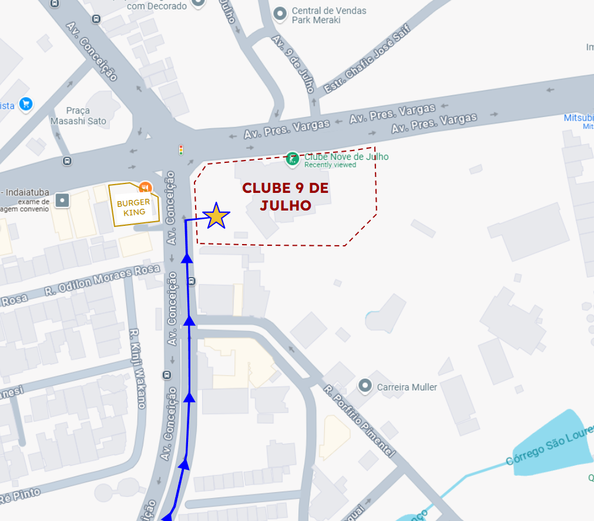
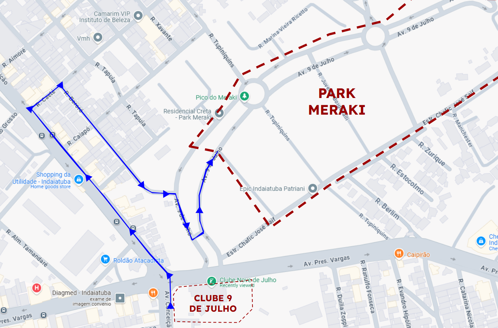

Após muita espera, estamos enfim divulgando o cronograma oficial de horários e translados entre os locais de evento. Como essa publicação é longa e repleta de detalhes, utilize o navegador abaixo para conseguir se direcionar rapidamente entre as seções:

- [1. Cronograma do primeiro dia](#1-cronograma-do-primeiro-dia)
- [2. Chegada e descarregamento](#2-chegada-e-descarregamento)
  - [Clube 9 de Julho](#clube-9-de-julho)
    - [**2.1 Entrada de Serviços do Clube 9 de Julho**](#21-entrada-de-serviços-do-clube-9-de-julho)
    - [**2.2 Ruas do Park Meraki**](#22-ruas-do-park-meraki)
- [3. Cafés e Refeições](#3-cafés-e-refeições)
- [4. Translado para pernoite](#4-translado-para-pernoite)
- [5. Cronograma do segundo dia](#5-cronograma-do-segundo-dia)
- [6. O que levar](#6-o-que-levar)

 

# 1. Cronograma do primeiro dia

 

| Horário       | Atividade                                                   |
|---------------|-------------------------------------------------------------|
| 7h00 - 9h00   | Chegada dos grupos + Café da manhã                          |
| 9h00 - 9h30   | Cerimônia de Abertura do Primeiro Dia                       |
| 9h30 - 12h00  | Primeira Parte do Workshop                                  |
| 10h30 - 12h00 | Reunião de Coordenadores dos grupos (somente coordenadores) |
| 12h00 - 14h00 | Almoço                                                      |
| 14h00 - 16h00 | Segunda Parte do Workshop                                   |
| 16h00 - 16h30 | Café da tarde                                               |
| 16h30 - 18h30 | Terceira Parte do Workshop                                  |
| 18h30 - 20h30 | Jantar                                                      |
| 20h30 - 21h30 | Translados para Alojamentos + Banhos                        |
| 21h30         | Horário Livre                                               |

 

# 2. Chegada e descarregamento
## Clube 9 de Julho
<!-- Inserir imagem do Maps indicando o local do estacionamento da Conceição -->

Conforme indicado na publicação inicial de logística, o [Clube 9](https://festivalkawasuji.com.br/avisos/logistica) será o local onde acontecerão as principais atividades do evento.

1. É importante que os grupos conduzam seus motoristas a entrarem pelo *Estacionamento de Serviços do Clube 9 de Julho* para realizar o descarregamento de instrumentos.
2. Em seguida, os motoristas deverão retirar seus veículos e estacioná-los nas *ruas do Park Meraki*, localizadas em frente à Entrada Principal do Clube. 

 

### **2.1 Entrada de Serviços do Clube 9 de Julho**

- **Localização**: Av. Conceição, 740 - Centro, Indaiatuba

Neste local, os grupos irão:
- Descarregar instrumentos
- Descarregar bolsas/bagagens que serão utilizadas no primeiro dia

... mas NÃO deverão:
- Estacionar permanentemente os ônibus/vans/carros

### **2.2 Ruas do Park Meraki**

- **Localização**: Av. 9 de Julho, R. Tupiniquins, Estr. Chafic José Saif  - Centro, Indaiatuba

Neste local, os motoristas estão autorizados a deixar os veículos estacionados nas ruas, desde que **não obstruindo** as entradas de condomínios e/ou rampas de acessibilidade, tanto no Primeiro Dia, quanto no Segundo.

# 3. Cafés e Refeições

Assim que chegarem ao evento, todos os participantes dos grupos irão receber um **cartão** impresso em papel, marcando todas as refeições, cafés e pernoite contratadas.
O cartão é de **uso individual, intransferível** e será utilizado para marcar as refeições, cafés e pernoites consumidas por cada um.
 

Solicitamos a atenção de cada coordenador/líder para evitar que os membros de cada grupo percam o cartão!

# 4. Translado para pernoite

Assim que o jantar for finalizado no Primeiro Dia, os grupos poderão:
- Organizar e armazenar seus instrumentos do Salão do Clube 9 de Julho
- Pegar seus pertences pessoais
- Contatar seus motoristas para buscá-los no Estacionamento de Serviço
- Instruir seus motoristas para levá-los à **Entrada Superior do Colégio Objetivo**.

- **Localização**: Alameda José Amstalden, 953 - Chácara Belvedere, Indaiatuba
 

Neste local, os motoristas estão autorizados a deixar os veículos estacionados na rua, desde que **não obstruindo** as entradas de estabelecimentos e/ou rampas de acessibilidade, durante a pernoite.

# 5. Cronograma do segundo dia

 

| Horário       | Atividade                                              |
|---------------|--------------------------------------------------------|
| 6h00 - 7h30   | Saída dos grupos do Colégio Objetivo                   |
| 7h30 - 9h00   | Chegada dos grupos + Café da manhã                     |
| 9h00 - 9h30   | Cerimônia de Abertura do Segundo Dia com Autoridades   |
| 9h30 - 12h00  | Primeira Parte das Apresentações dos Grupos            |
| 12h00 - 14h00 | Almoço                                                 |
| 14h00 - 16h30 | Segunda Parte das Apresentações dos Grupos             |
| 16h30 - 17h00 | Café da tarde                                          |
| 17h00- 18h00  | Apresentação Wadan Taiko Ensemble + Líderes dos Grupos |

 

# 6. O que levar

> **Atenção:** Para que possamos atender às normas de limite de ruído e segurança auditiva, será necessário que para o Workshop sejam utilizados **abafadores nos instrumentos**. Sabemos o quanto essa prática não é comum para alguns grupos que possuem o costume de não utilizá-los - mas esse foi um requerimento obrigatório para que a cidade de Indaiatuba possa futuramente organizar o evento novamente.
> 
>  
> Contamos com a colaboração de todos!

**A. Para o Workshop:**
- Abafadores de instrumentos (toalhas/lençóis/cobertores antigos que podem ser danificados) para todos os instrumentos
- Roupas apropriadas para exercícios físicos
- Repelente de insetos
- Bachis variados
- Narimono: Tyappa, Jyangara
- Shinobue
- Correias de Katsugi

**B. Para o banho:**
- Itens de higiene pessoal
- Toalha

**C. Para a pernoite:**
- Roupa de cama (lençol para colchão de solteiro)
- Travesseiro
- Cobertor fino
- Repelente de insetos
- Pijamas
- Chinelos

**D. Específicos:**

- *Não se esquecer de itens individuais específicos, tal como medicamentos ou itens ortopédicos.*

 

[[^ Voltar ao topo ^]](#top)

Para o caso de dúvidas antecipadas, entrar em [Contato](https://festivalkawasuji.com.br/contato).
 
 
 
 