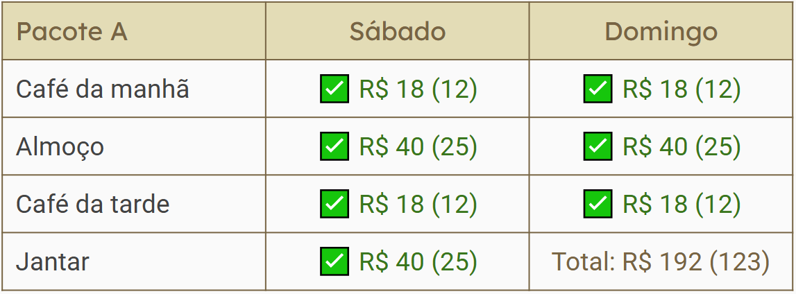
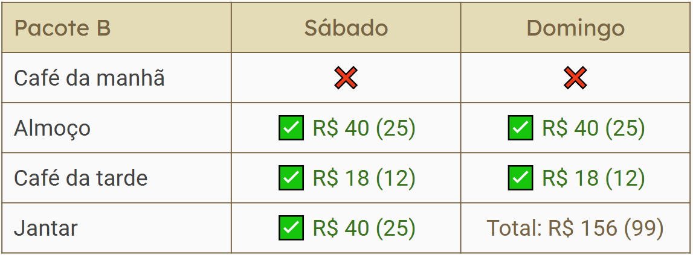
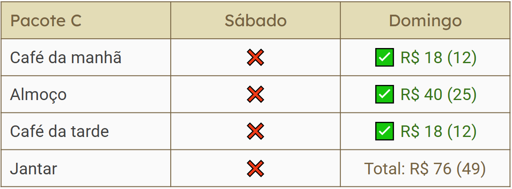

_Flexibilização de alimentação através de pacotes!_

## Aviso de ajuste adicional no modelo de alimentação!

### Importante: ler até o final!

Após mais pedidos realizados por grupos que irão participar do evento, a coordenação do Festival Kawasuji decidiu idealizar e implementar um modelo que servirá para **flexibilizar** a contratação da alimentação.
- Até então, só era possível aderir a todas as refeições e todos os cafés da manhã simultaneamente. Caso se optasse não pagar por alguma refeição, o participante deveria abrir mão de todas as outras.
- Com o novo modelo, será possível que cada participante escolham 1 dos pacotes disponíveis, detalhados abaixo:

**Pacote A**: destinado àqueles que estarão presentes ao longo de todo o evento tocando Taiko sem parar!
 
 

**Pacote B**: para participantes que estarão alojados em hotéis/pousadas que já contam com café da manhã inclusos no preço.
 
 

**Pacote C**: voltado principalmente para acompanhantes que irão aproveitar sua estadia pela cidade de Indaiatuba no sábado sem participar diretamente do Workshop.
 
 

---

### Atenção!
Como próximos passos, a coordenadoria do XVII Festival Kawasuji comunica:
1. Estamos realizando **ajustes** diretos na calculadora e no Formulário de Inscrição para permitir os ajustes realizados.
2. Com este tempo de *downtime* da calculadora, estamos **prorrogando o término das Inscrições Oficiais para o dia 31/01 (sexta-feira)**!

Aguardamos a participação de todos no evento!
 
 

[[Top]](#top)

Caso precise de ajuda para ingressar na (3) Lista de Comunicação, entre em [Contato](https://festivalkawasuji.com.br/contato) via e-mail ou WhatsApp indicando seu nome e e-mail do grupo correspondente.
 
 
 
 
**Observação**: Enquanto estiver lidando com meios de comunicação online, certifique-se de cuidar de sua privacidade. Sua segurança é a prioridade!
 
 
 
 