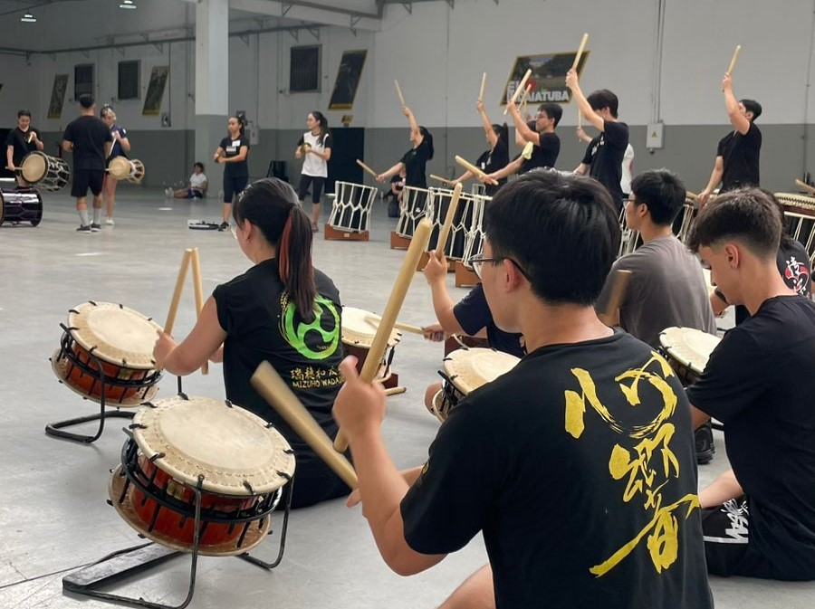
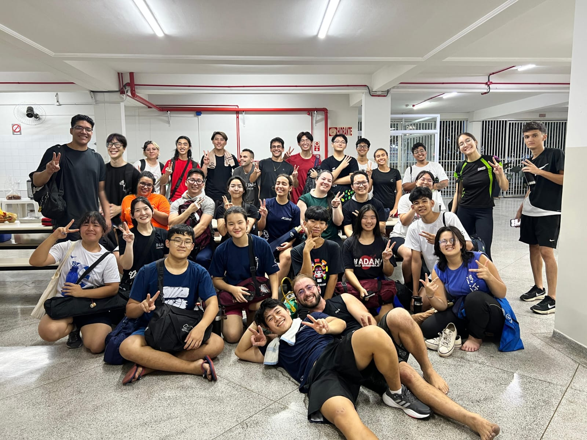

## A Semana de Líderes do XVII Festival Kawasuji foi um sucesso!

Em nome dos grupos Ryuu Taiko e Yashika Daiko, gostaria de agradecer a todos que participaram do evento. Foi emocionante ver como vocês, líderes, foram capazes de formar laços de integração e unir energias para aprender novas técnicas para a grande performance que está para acontecer no dia 16 de março.

Gostaria de prestar agradecimentos especiais ao grupo *Wadan Taiko Ensemble* - em especial, aos coordenadores **Jun Aoyama** e **Lincoln Sugiyama** - por terem abraçado mais uma vez a enorme responsabilidade que é desenvolver e lapidar a apresentação mais importante do Festival Kawasuji.

> Por último: gostaria de reforçar a mensagem realizada aos líderes, e solicitar aos mesmos que até março **preservem os materiais aprendidos nos 4 dias de workshop em segredo**. Incentivamos durante a semana a gravação de mídia para proporcionar o aprendizado; mas não vamos ultrapassar este propósito para não estragar a surpresa que está por vir, certo?

Novamente, obrigado a todos pela contribuição e pelo esforço!

Nos encontramos em março.
 
 
- Ryu Nakamura
 
 

[[Top]](#top)

Caso precise de ajuda para ingressar na (3) Lista de Comunicação, entre em [Contato](https://festivalkawasuji.com.br/contato) via e-mail ou WhatsApp indicando seu nome e e-mail do grupo correspondente.
 
 
 
 
**Observação**: Enquanto estiver lidando com meios de comunicação online, certifique-se de cuidar de sua privacidade. Sua segurança é a prioridade!
 
 
 
 