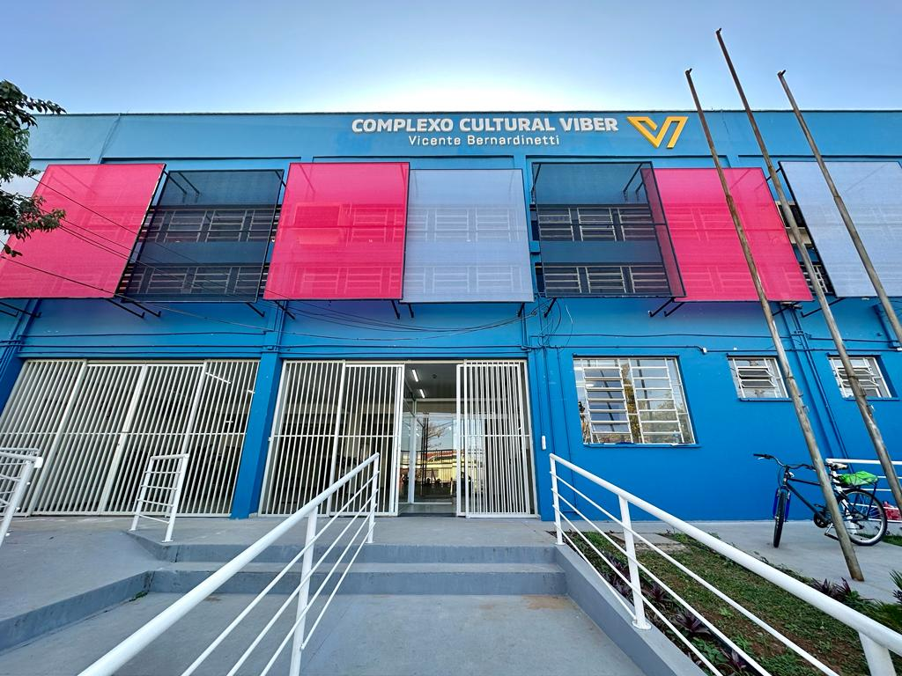
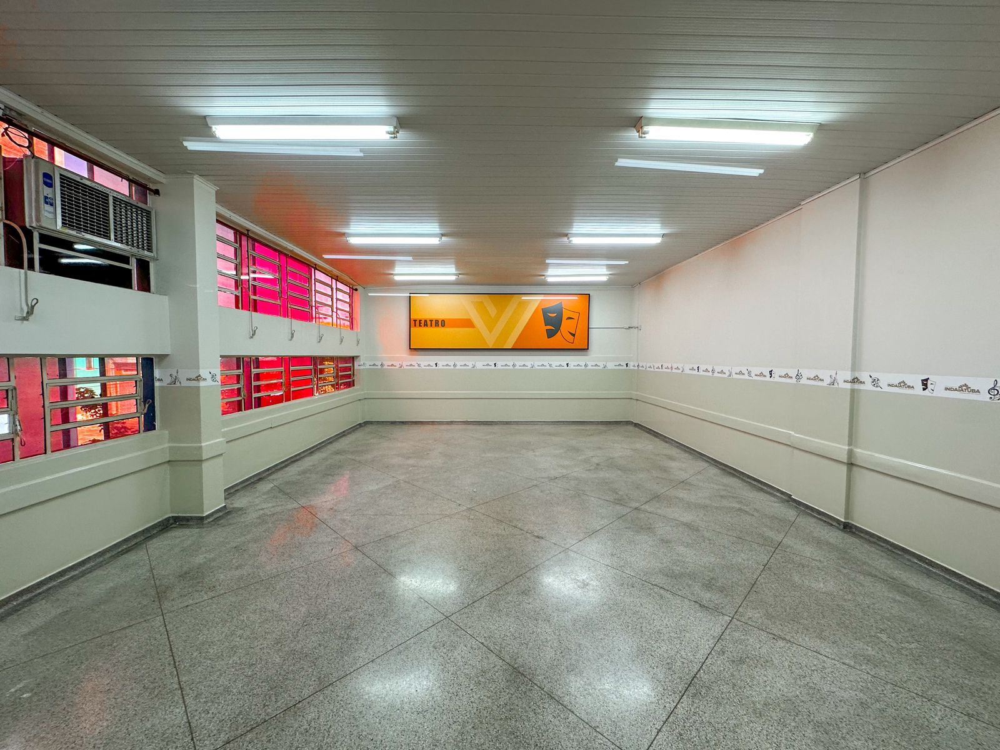
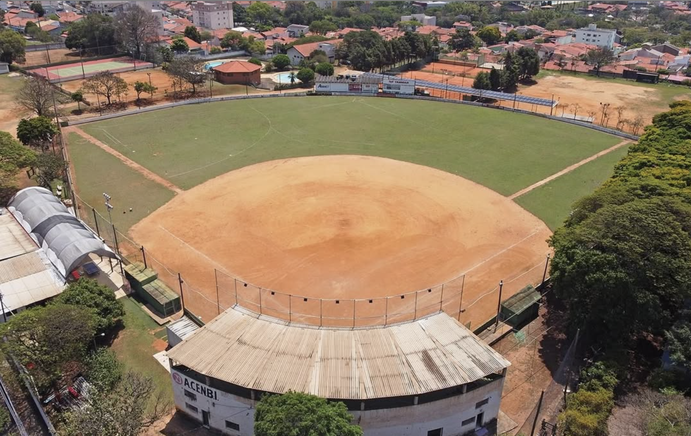

_Cronograma em alto nível + dicas de locomoção durante o Treino de Líderes_

## [Atualização] Guia rápido de atividades durante a Semana de Treino de Líderes!

A Semana de Treino de Líderes irá acontecer entre os dias **21 e 24 de janeiro de 2025.**
Esta etapa do evento possui como objetivo integrar os líderes dos grupos, proporcionando ensinamentos avançados que irão ser efetivamente mostrados durante a Apresentação dos Líderes no XVII Festival Kawasuji, em março.

> Ao todo, serão 31 líderes de 17 diferentes grupos.

Para garantir propriamente o andamento do evento, leia atentamente as informações abaixo - e não hesite em entrar em contato caso surjam dúvidas!

Além disso, caso algum dos líderes de seu grupo não tenha ingressado no grupo de WhatsApp, favor entrar em [contato](https://festivalkawasuji.com.br/contato) e fazê-lo o mais rápido possível.

1. [Horários e pontos de chegada](#horários-e-pontos-de-chegada)
2. [Sobre os locais do evento](#sobre-os-locais-do-evento)
3. [Sobre os translados](#sobre-os-translados)
4. [O que levar](#o-que-levar)
5. [Alimentação](#alimentação)
6. [Observações finais](#observações-finais)

 

### Horários e pontos de chegada

| Evento                                      | Dia        | Horário            | Local               |
|---------------------------------------------|------------|--------------------|---------------------|
| Chegada dos líderes                         | 21 (terça) | 11h00 - 12h00      | Polo Cultural Viber |
| Primeiro treino com Wadan Taiko             | 21 (terça) | 14h00 - 18h00      | Polo Cultural Viber |
| Treinos com Wadan Taiko                     | 22 a 23    | 8h00 - 18h00       | Polo Cultural Viber |
| Banhos e pernoites                          | 21 a 23    | 18h00              | ACENBI              |
| Último treino com Wadan + Encerramento      | 24 (sexta) | 8h00 - 14h00       | Polo Cultural Viber |

*Nota: O primeiro dia (21) irá se iniciar a partir do almoço; e o encerramento dos treinos (24) irá acontecer logo após o almoço.*

---

### Sobre os locais do evento

---

#### A. Complexo Cultural Viber

- Localização: R. Paraná, 65 - Cidade Nova II
- Espaço amplo para realização dos treinos em todos os dias
- Próximo à supermercados e farmácias (< 6 minutos à pé)

 

 
 
 

#### B. ACENBI - Associação Cultural e Esportiva Nipo-brasileira de Indaiatuba

- Localização: R. Chile, 689 - Jardim Moacyr Arruda
- Banheiros com chuveiros e salas de aula da Escola de Língua Japonesa com colchões
- Proximidade com avenida principal (Av. Conceição) e entrada da cidade

---

### Sobre os translados

O translado entre os locais de treino e pernoite serão realizados através de 2 viagens de van, em serviço contratado pelos grupos Ryuu Taiko e Yashika Daiko. 

---

### O que levar

**1. Para o treino:**
- Roupas apropriadas para exercícios físicos
- Repelente de insetos
- Bachis variados
- Narimono: Tyappa, Jyangara
- Shinobue: **número 6 e número 8**
- Correias de Katsugi
- Base sentada (*za-dai*) de shime-daiko - somente se possível
- Katsugi okedo-daiko - somente se possível
- Caderno e itens para anotação
- Garrafa d'água

**2. Para o banho:**
- Itens de higiene pessoal
- Toalha

**3. Para a pernoite:**
- Repelente de insetos
- Pijamas
- Chinelos
- Roupa de cama (lençol para colchão de solteiro)
- Travesseiro
- Cobertor fino

**4. Específicos:**

*Não se esquecer de itens individuais específicos, tal como medicamentos ou itens ortopédicos.*

---

### Alimentação

A alimentação ao longo de todos os dias de evento será feita através de marmitas fornecidas por terceiros.
Para lidar com as restrições alimentares apontadas durante a inscrição, antes de cada refeição a organização do evento irá fornecer as opções de marmitas do dia para que os líderes escolham individualmente.

(Todas as refeições já estão foram contempladas no valor pago na inscrição).

---

### Observações finais
O Treino de Líderes é um evento tradicional parte do Festival Kawasuji de Taiko. Ao longo da imersão proporcionada pelos ensinamentos do grupo *Wadan Taiko Ensemble*, os líderes serão levados aos seus limites, em **ritmos de treino elevados** justamente para permitir um **desenvolvimento acentuado**. Com isso, será necessário por parte dos líderes:
- Realização de exercícios de resistência física
- Aprendizado de músicas longas e complexas em pouco tempo
- Proficiência em instrumentos específicos
- Proatividade e capacidade de trabalho em equipe

Por isso - pedimos que os líderes inscritos se preparem e mantenham suas cabeças abertas para receber uma experiência única durante a Semana de Líderes do XVII Festival Kawasuji de Taiko!

Esperamos por você!

---

[^ Voltar ao topo ^](#top)
 

Caso precise de ajuda para ingressar na (3) Lista de Comunicação, entre em [Contato](https://festivalkawasuji.com.br/contato) via e-mail ou WhatsApp indicando seu nome e e-mail do grupo correspondente.
 
 
 
 
**Observação**: Enquanto estiver lidando com meios de comunicação online, certifique-se de cuidar de sua privacidade. Sua segurança é a prioridade!
 
 
 
 